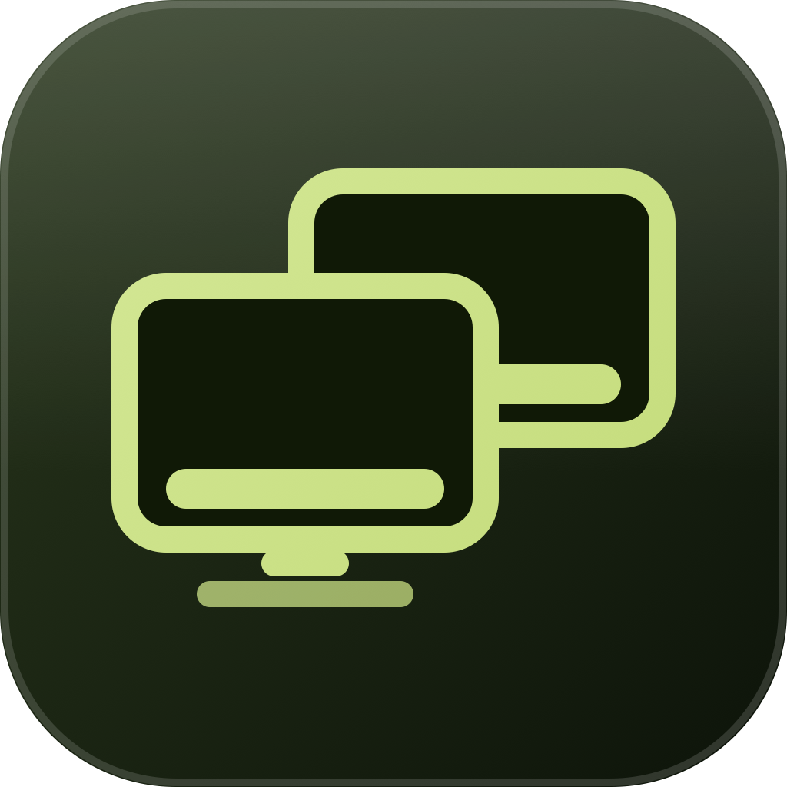

<div align="center">



# macdock

**A Dock on every display. The one macOS won't give you.**

[](LICENSE)


</div>

---

## The problem

macOS gives you exactly one Dock. On a multi-monitor setup it either hops
between screens on a hair trigger, or you turn on *Displays have separate
Spaces* and inherit a window-management model you did not ask for. The
long-standing workaround, shoving the cursor past the bottom edge of the
screen you want, is unreliable the moment your displays are not perfectly
bottom-aligned.

macdock puts a real dock on every display and leaves your Spaces settings
alone.

## Features

- **A dock on every screen**, positioned bottom, left or right, independently
  per display
- **Per-display app filtering**, so comms live on one screen and tools on another
- **Auto-hide**, retreating to a sliver at the screen edge until you point at it
- **No permissions required.** macdock asks for nothing at all
- **Native Liquid Glass** on macOS 26, not a CSS imitation
- **Never steals focus.** Clicking a dock icon does not deactivate the app
  you are working in

## Status

Early development. Phase 0 (capability validation) is complete and every
required API is confirmed working on macOS 26.5.1. See
[docs/PHASE-0-RESULTS.md](docs/PHASE-0-RESULTS.md) for the probe report and
[docs/IMPLEMENTATION_PLAN.md](docs/IMPLEMENTATION_PLAN.md) for what ships when.

## Requirements

macOS 26 (Tahoe) or later, Apple Silicon.

**Permissions.** None. Every action macdock performs goes through
`NSRunningApplication` and `NSWorkspace`, neither of which needs a grant. If a
future version needs one, it will ask at the moment the feature is used and not
before.

## Why it is not on the Mac App Store

Per-display Space awareness has no public API. macdock uses a small, isolated
set of private SkyLight symbols to get it, which rules out App Store
distribution. Every private symbol is resolved at runtime and every feature
depending on one degrades to a working fallback rather than failing, so a
future macOS removing them costs you a feature, never a crash.

Distribution is a notarized DMG and a Homebrew cask.

## Building

```bash
brew install xcodegen swiftlint
```

```bash
git clone https://github.com/USERNAME/macdock.git && cd macdock && xcodegen generate
```

## Contributing

Read [CONTRIBUTING.md](CONTRIBUTING.md) first. It covers branch naming, commit
format, Swift conventions, and the file-size limits CI enforces.

## Credits

macdock is an independent, clean-room implementation. Two existing projects
were read for background on macOS window-management behaviour and are
gratefully acknowledged, though no code was taken from either:
[MultiDock](https://github.com/DmitryChichikalyuk/MultiDock) and
[Docky](https://github.com/josejuanqm/docky).

## License

MIT. See [LICENSE](LICENSE).
