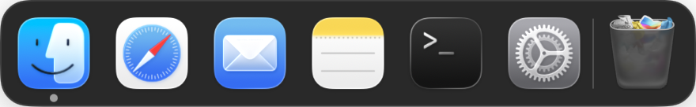
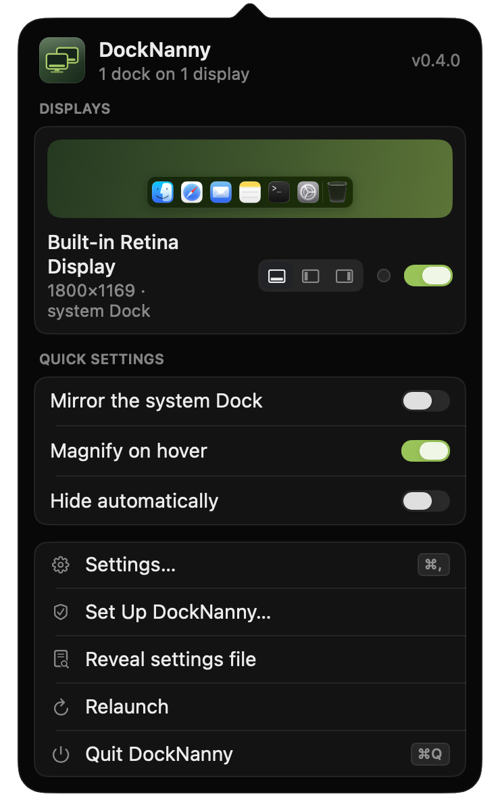
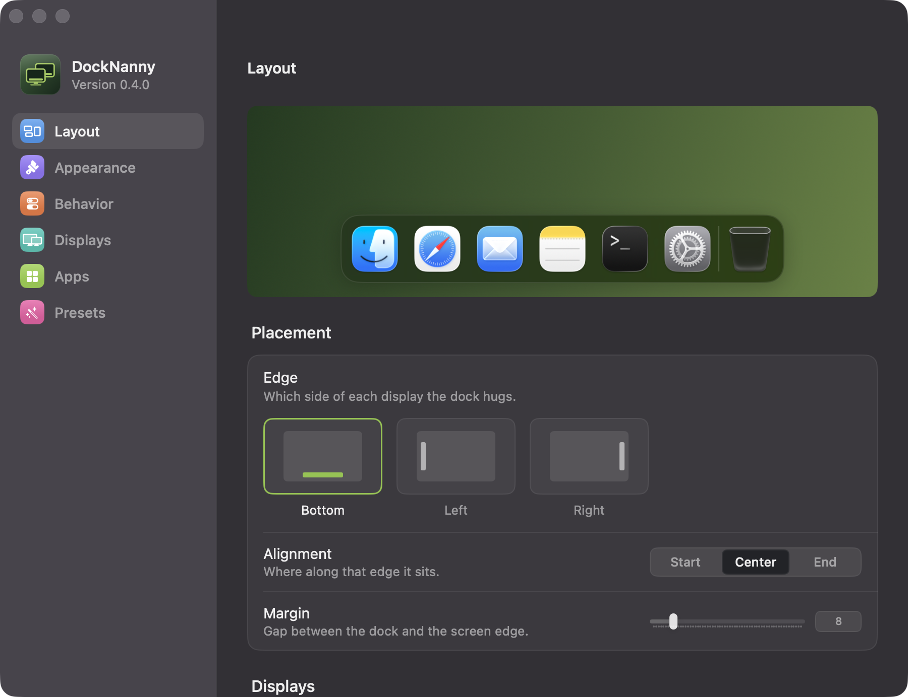
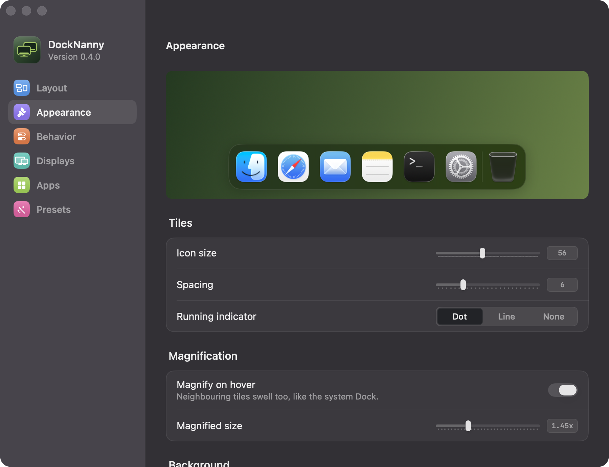
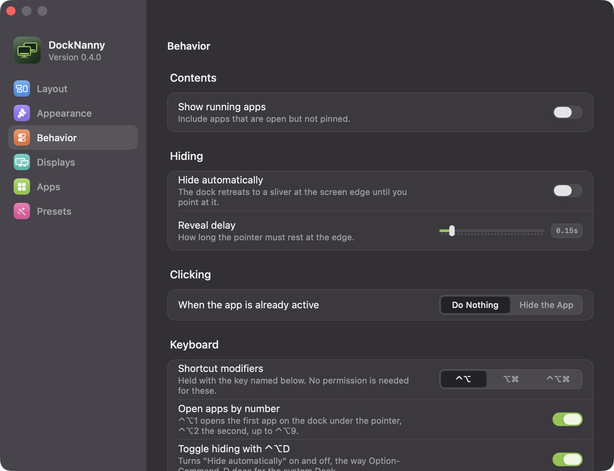
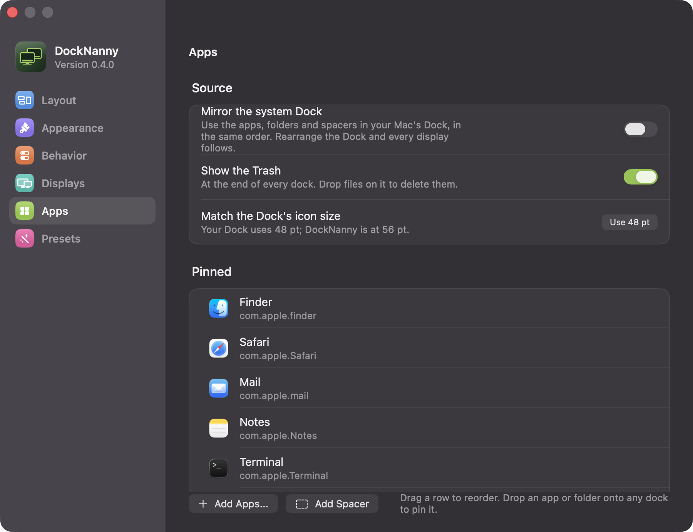
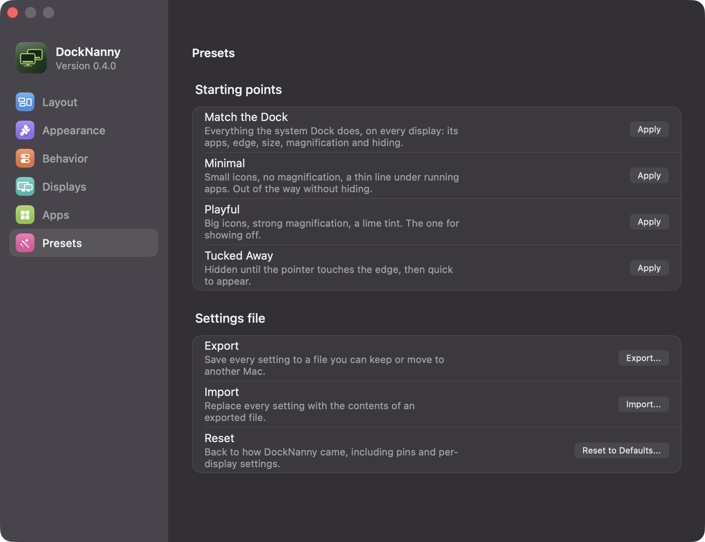
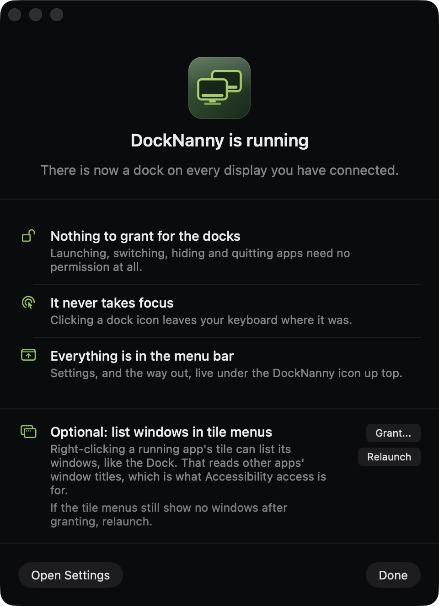

<div align="center">


<br />

**A dock on every display. The one macOS won't give you.**<br />
Your Dock, mirrored to every screen you plug in, with the parts macOS keeps to itself: magnification that spreads, a Trash that fills, folders that open as lists, and windows that stay clear of it.

[](https://github.com/mukes555/docknanny/actions/workflows/ci.yml)
[](https://github.com/mukes555/docknanny/releases)
[](LICENSE)


<br />



</div>

## Why

macOS gives you exactly one Dock. On a multi-monitor setup it either hops
between screens on a hair trigger, or you turn on *Displays have separate
Spaces* and inherit a window-management model you did not ask for. The
long-standing workaround, shoving the cursor past the bottom edge of the
screen you want, is unreliable the moment your displays are not perfectly
bottom-aligned.

DockNanny puts a real dock on every display, stays off the one that already has
the system Dock, and leaves your Spaces settings alone.

## What you get

**Your Dock, again.** By default DockNanny mirrors the system Dock: the same apps
in the same order, Finder first, folders and spacers where you put them,
running apps after the pins, the Trash at the end. Rearrange the real Dock and
every display follows within two seconds. Turn mirroring off and each list is
yours.

**Dock behaviour, not a lookalike.** Magnification spreads neighbours apart
rather than covering them, so a click can only ever mean one tile. Press
feedback, launch bounce, hover labels, Command-click to reveal, Option-click to
hide the others, drag to rearrange with a live gap, drag a tile off to remove
it with the poof, and drag one from one display's dock to another's. Right-click
a running app for its windows, like the Dock. Folder tiles open as a list.

**Windows stay clear of it.** With one optional grant, a window opened or
zoomed into a dock's space is nudged to sit beside it, the effect the system
Dock gets from its reserved strip.

**Every display its own.** Edge, size, tint, hiding and which apps are shown
can all differ per display, and a display keeps its settings across unplugging.

**Keyboard.** Control-Option-1 to 9 open the first to ninth app on the dock
under the pointer; Control-Option-D toggles hiding. Modifiers are configurable.

**Never in the way.** Clicking a dock icon does not deactivate the app you are
working in. Idle cost is a rounding error: 0.0 to 0.1 percent CPU and 17 MB.

## The screens

**The tray** drops from the menu bar mark: one card per display with a live
preview of its dock, an edge switcher, a tint and an on/off switch, plus the
quick settings.

<div align="center"></div>

**Layout** is where the dock goes and how big it is, with the preview updating
as you drag.



**Appearance** covers the glass, the indicators, magnification and tint.



**Behavior** holds hiding, clicking, the keyboard shortcuts, and keeping
windows clear of the dock.



**Apps** is the pin list: mirrored from the system Dock, or your own with
drag-to-reorder, spacers and a folders section.



**Presets** are starting points, one of which copies the system Dock's edge,
size, magnification and hiding, and the settings file can be exported,
imported or reset.



### Keyboard

| Keys | Action |
| --- | --- |
| `Ctrl+Opt+1` to `9` | Open the first to ninth app on the dock under the pointer |
| `Ctrl+Opt+D` | Toggle "Hide automatically" |
| `Cmd+,` | Settings, from the tray or any window |
| `Cmd+1` to `6` | Switch Settings sections |
| `Esc` | Close the tray |

## Install

Download the DMG from the [latest release](https://github.com/mukes555/docknanny/releases),
drag DockNanny into Applications, and launch it. It lives in the menu bar as two
small displays.

Until releases are signed with a Developer ID, Gatekeeper will say the app
cannot be checked for malware. Clear that once with:

```bash
xattr -d com.apple.quarantine /Applications/DockNanny.app
```

A Homebrew cask template is in [packaging/homebrew](packaging/homebrew).

**Requirements.** macOS 26 (Tahoe) or later, Apple Silicon.

## Permissions

None to start. Every action goes through `NSRunningApplication`,
`NSWorkspace`, the Dock's own preferences and Carbon hot keys, none of which
needs a grant. Three things ask for something, only when you use them, and
work without it otherwise:

- **Window lists in tile menus** and **Keep windows clear of the dock** read
  other apps' windows, which is Accessibility access. Grant it from the setup
  window under the menu bar icon; the docks never need it.
- **Folder tiles** read the folder they show, so macOS may ask about that
  folder (Downloads, Desktop and the like).
- **Empty Trash** asks Finder to do the emptying, which is an Automation
  prompt for controlling Finder. Finder keeps its own "permanently erase?"
  confirmation.

<div align="center"></div>

One thing the system Dock's menu has that DockNanny's cannot: an app's own menu
section (a browser's profiles, an editor's recent windows). Apps hand that to
the Dock over a private channel on which the Dock is the server, so no other
process can ask for it.

## Privacy

DockNanny has no network access and no analytics. Settings live in one JSON file
at `~/Library/Application Support/DockNanny/settings.json`, which you can export,
import or reset from Settings. The unified log carries no window titles or
bundle identifiers in the clear.

## Building

```bash
brew install xcodegen swiftlint
```

```bash
git clone https://github.com/mukes555/docknanny.git && cd DockNanny && xcodegen generate && open DockNanny.xcodeproj
```

`tools/dev.sh` builds, signs and relaunches a development build so its
Accessibility grant survives rebuilds. `tools/release.sh` builds a DMG (ad hoc
by default; set `CODESIGN_IDENTITY` and `NOTARY_PROFILE` for a notarized
one). Launch flags: `--settings [--section=layout|appearance|behavior|displays|apps|presets]`,
`--setup`, `--tray`, `--settings-dir=<folder>` for a separate profile, and
`--probe-windows=<app>` to record what Accessibility and the window server
say about an app's windows when one will not stay clear of a dock.

The app logs under the `app.docknanny` subsystem:

```bash
/usr/bin/log stream --level info --predicate 'subsystem == "app.docknanny"'
```

## What is next

See [docs/IMPLEMENTATION_PLAN.md](docs/IMPLEMENTATION_PLAN.md). Window
previews on hover are the next piece.

## Contributing

Read [CONTRIBUTING.md](CONTRIBUTING.md) first. It covers branch naming, commit
format, Swift conventions, and the file-size limits CI enforces.

## Credits

DockNanny is an independent, clean-room implementation. Two existing projects
were read for background on macOS window-management behaviour and are
gratefully acknowledged, though no code was taken from either:
[MultiDock](https://github.com/DmitryChichikalyuk/MultiDock) and
[Docky](https://github.com/josejuanqm/docky).

## License

MIT. See [LICENSE](LICENSE).
